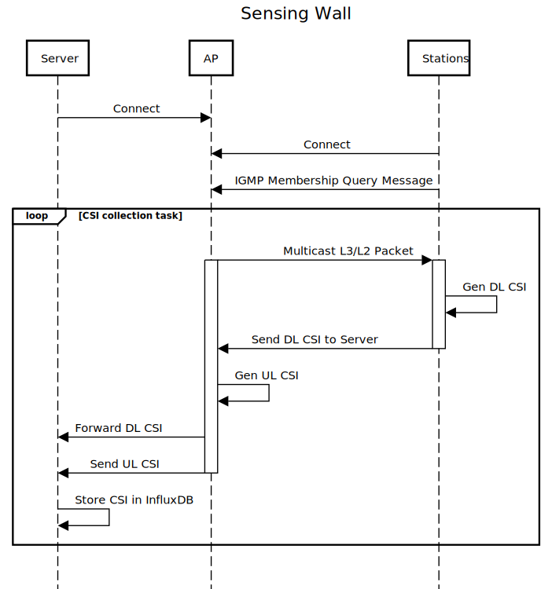

# Sensing Wall
This project aims to develop a testbed for testing large-scale wireless sensing application relying on processing of Channel State Information (CSI).

It utilizes the ESP32 platform for the generation of CSI data and contains a framework for the centralized collection and storage of said data from a number of nodes.

## Architecture

There are three main components:
* one ESP32 node acting as an WiFi Acess Point (see left node in picture)
* 1-N ESP32 nodes arranged in a 2D grid operating in station mode (see right nodes in picture)
* one powerful server (e.g., laptop) used to store the CSI data in a time-series database (InfluxDB) with tools for visualization (Grafana) and processing (Python)

The following sequence diagram demonstrates the interaction between those three components:

## Installation

The installation process contains the following steps:
* building and flashing the ESP32 nodes (AP and N stations) - see Makefile
* installation of server components (InfluxDB, Grafana, Prometheus) - see server/docker-compose.yaml

## Acknowledgement

This project uses parts of [esp32-csi-server](https://github.com/roger-/esp32-csi-server) and [ESP32-CSI-Tool](https://github.com/StevenMHernandez/ESP32-CSI-Tool) in addition to the example on the [official ESP-IDF repo](https://github.com/espressif/esp-idf).