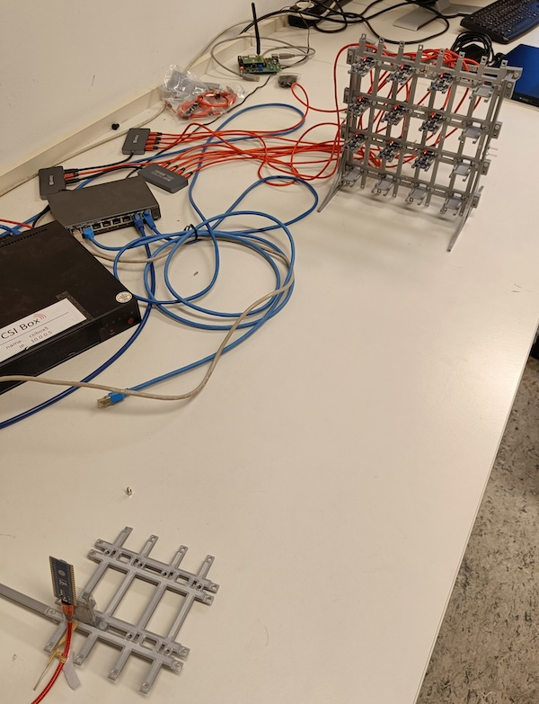

# Sensing Wall
This project aims to develop a testbed for testing large-scale wireless sensing application relying on processing of Channel State Information (CSI).

It utilizes the ESP32 platform for the generation of CSI data and contains a framework for the centralized collection and storage of said data from a number of nodes.



## Architecture

There are three main components:
* one ESP32 node acting as an WiFi Acess Point (see left node in picture)
* 1-N ESP32 nodes arranged in a 2D grid operating in station mode (see right nodes in picture)
* one powerful server (e.g., laptop) used to store the CSI data in a time-series database (InfluxDB) with tools for visualization (Grafana) and processing (Python)

The following sequence diagram demonstrates the interaction between those three components:


## Installation

The installation process contains the following steps:
* building and flashing the ESP32 nodes (AP and N stations) - see Makefile
```
make ap_flash PORT=/dev/ttyACM0
make sta_flash PORT=/dev/ttyACM2
```
* start docker (InfluxDB, Grafana, Prometheus) on the server node:
```
docker compose run
```
* installation of server components (InfluxDB, Grafana, Prometheus) - see `server/docker-compose.yaml`

* connect server node via WiFi to AP node. Therefore, prepare WPA-Supplicant

Setup wpa_supplicant config `/etc/wpa_supplicant/wpa_supplicant.conf`
```
ctrl_interface=DIR=/var/run/wpa_supplicant GROUP=netdev
update_config=1
country=DE

network={
	ssid="sensing-wall"
	key_mgmt=NONE
}
```

Setup interface `/etc/network/interfaces`
```
# interfaces(5) file used by ifup(8) and ifdown(8)

auto wlp101s0
iface wlp101s0 inet static
    address 192.168.4.11
    netmask 255.255.255.0
    wpa-conf /etc/wpa_supplicant/wpa_supplicant.conf
```

* offload InfluxDB database to tmpfs to improve performance

Create tmpfs
```
mount -t tmpfs none /mnt
```

Create tmpfs on startup `/etc/fstab`
```
tmpfs    /mnt    tmpfs    defaults,size=40%      0       0
```

Link tmpfs
```
ln -s /mnt/server_influxDb/ influxDb
```

Init tmpfs via systemd. Create the service file `/etc/systemd/system/init-fsram-influxdb.service`
```
[Unit]
Description=Script to init ramfs in /mnt after fstab
After=local-fs.target

[Service]
Type=simple        
ExecStart=/bin/bash -c "cp -rp /home/csibox/sensing_wall/server/influxdb_data_hdd /mnt/server_influxDb"


[Install]
WantedBy=multi-user.target
```
Test the job

```
sudo service init-fsram-influxdb start
```

Enable job on startup

```
sudo systemctl enable init-fsram-influxdb.service
```

* start collector
```
cd server
python3 server_ng_parallel.py
```

make collector restarting on reboot. Make therefore sure that all required packets are installed for user `root`.
You can check it via using
```
su
python3 server_ng_parallel.py
```

Now, create the service file `/etc/systemd/system/sensingwallserver.service`
```
[Unit]
Description=Sensingwall Server
After=network.target

[Service]
#StartLimitIntervalSec=0[Service]
Type=simple
Restart=always
RestartSec=1
ExecStart=/usr/bin/python3 /home/csibox/sensing_wall/server/server_ng_parallel.py

[Install]
WantedBy=multi-user.target
```
 Test the job

```
sudo service sensingwallserver start
```

Enable job on startup

```
sudo systemctl enable sensingwallserver.service
```

* add hosts
```
127.0.0.1	influxdb
127.0.0.1	prometheus
```


## Acknowledgement

This project uses parts of [esp32-csi-server](https://github.com/roger-/esp32-csi-server) and [ESP32-CSI-Tool](https://github.com/StevenMHernandez/ESP32-CSI-Tool) in addition to the example on the [official ESP-IDF repo](https://github.com/espressif/esp-idf).
